# Hospital Management System

A Java-based desktop application for managing hospital records, patients, appointments, and other administrative tasks using Swing and AWT.

---

## 💡 Features

- Patient registration
- Appointment scheduling
- Doctor assignment
- Database integration using MySQL
- Simple and intuitive UI with Java Swing
- Secure login for admin/staff

---

## 🛠️ Technologies Used

- Java (Swing & AWT)
- MySQL
- JDBC
- IntelliJ
- Git for version control

---

## 🚀 How to Run

1. Clone the repository:
   ```bash
   git clone https://github.com/Shashank172003/Hospital_Management_System.git

   ## 📸 Screenshots

### 1
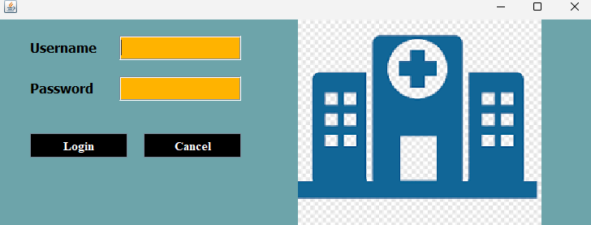

### 2


### 3
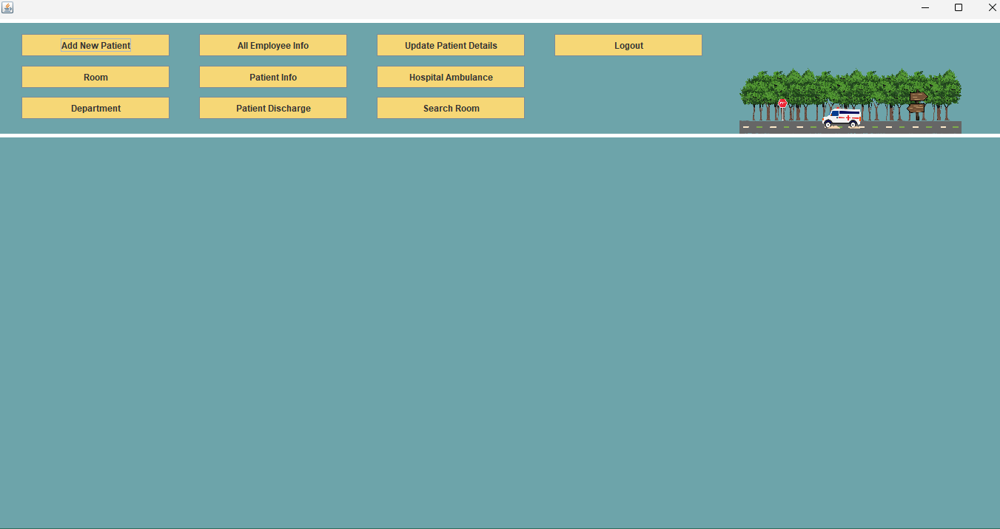

### 4
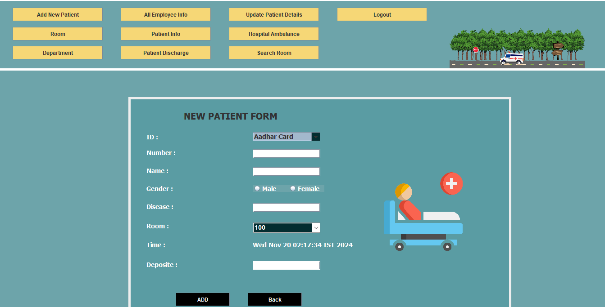

### 5
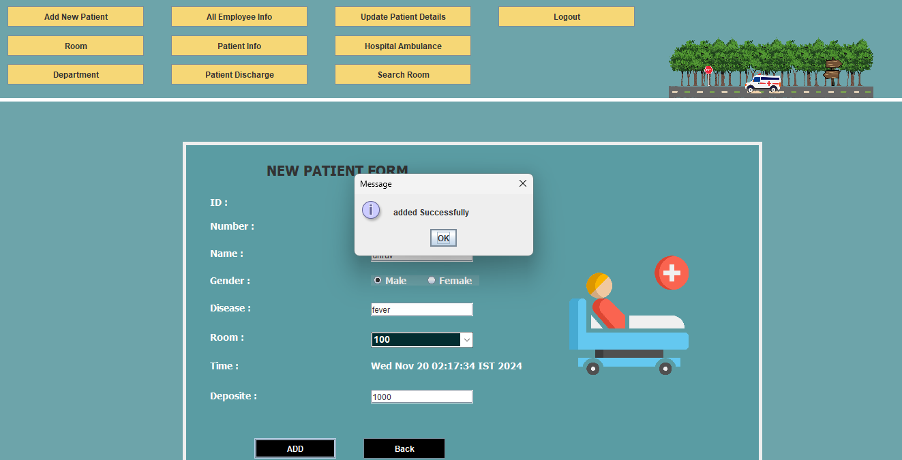

### 6
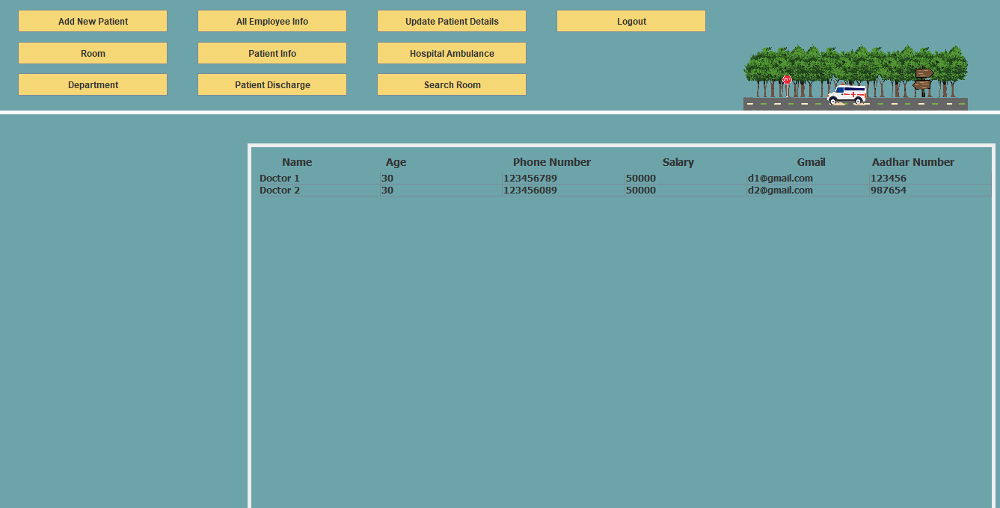

### 7
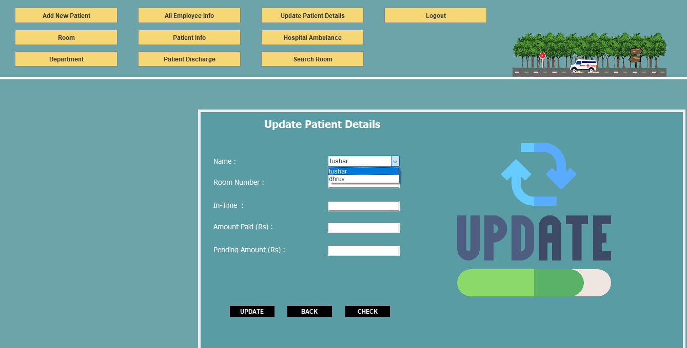

### 8
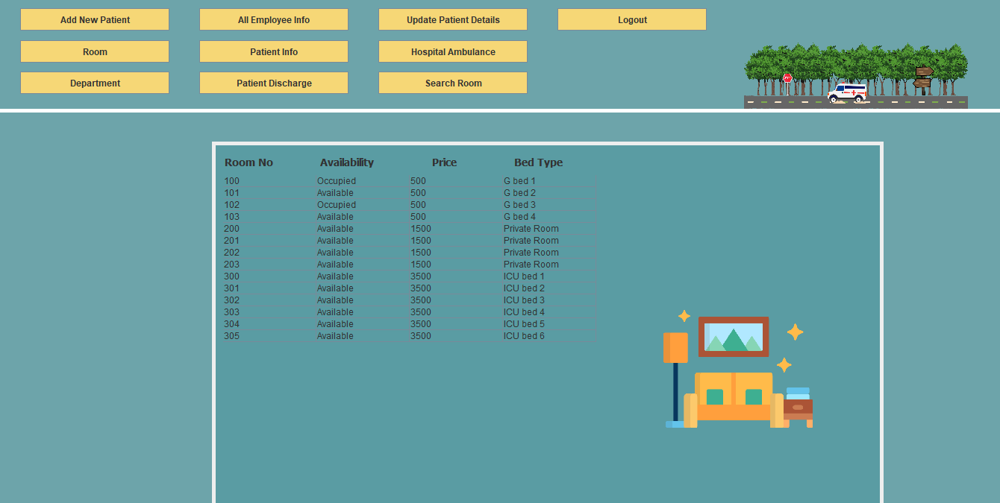

### 9
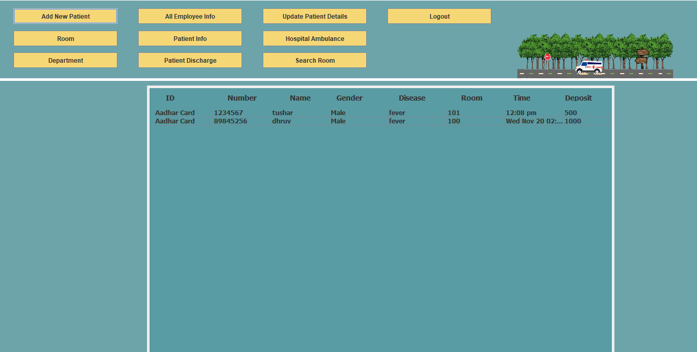

### 10
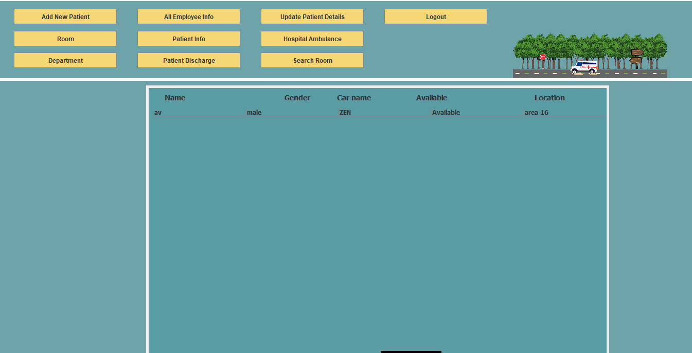

### 11
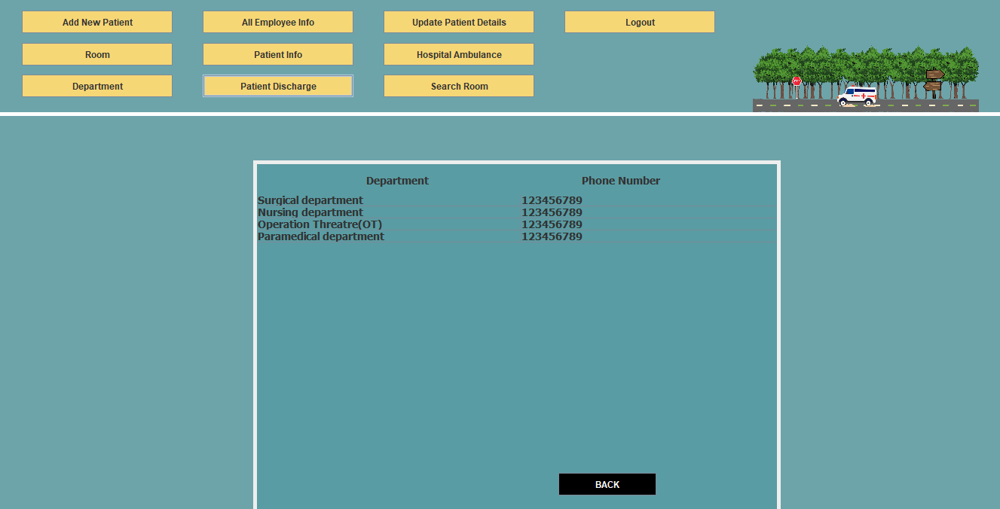

### 12
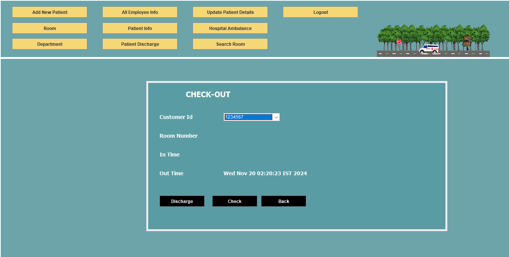

### 13
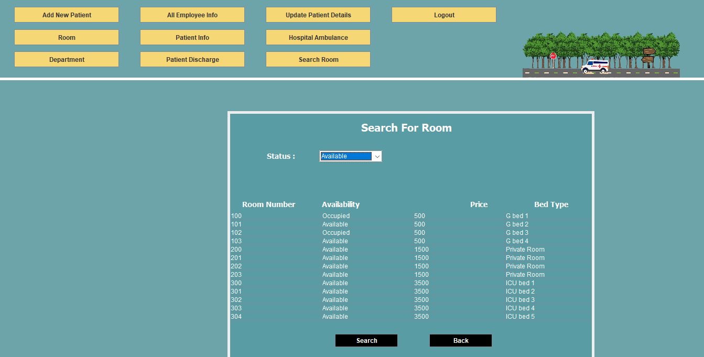

